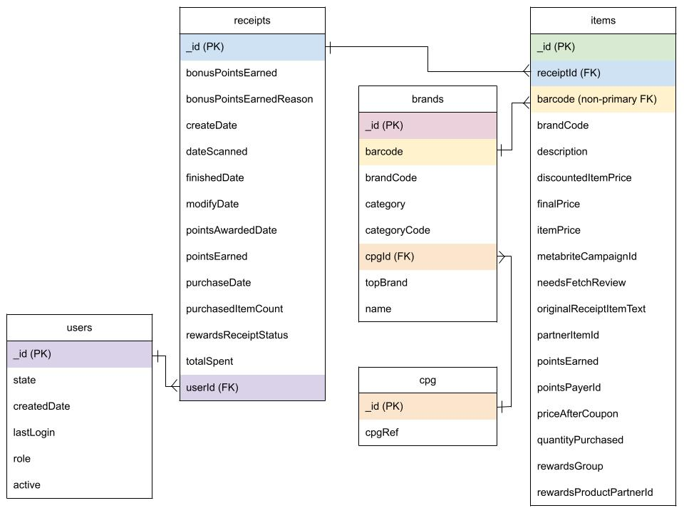

# Fetch Take-Home Case Study  
### By Brandon Sung  
#### Date: 11/09/2024  

## SQL  
This assignment uses PySpark, my preferred stack. It has better processing for large datasets and a simpler transition between Python and SQL.
However for question 2, I also wrote the answers in Spark SQL, to demonstrate my abilities to write SQL.

My work is in the Jupyter Notebook found [here](fetch_assignment.ipynb).

---

## ER diagram (Question 1)
Below is the ER diagram for **Question 1**


---
## Queries to answer business questions (Question 2)
To answer the questions, I used pyspark - although I provided Spark SQL in the [notebook] (fetch_assignment.ipynb)
to demonstrate my abilities in SQL. 


What are the top 5 brands by receipts scanned for most recent month?
How does the ranking of the top 5 brands by receipts scanned for the recent month compare to the ranking for the previous month?
```python
# set up windows
ct = Window.partitionBy(F.col('month')).orderBy(F.col('receipt_ct').desc())
lag = Window.partitionBy(F.col('name')).orderBy(F.col('month'))
# do the joins (we will need these later)
items_with_brand = items_df.join(brands_df, 'barcode', 'left' )
receipt_with_brand = (
    items_with_brand
 .join(receipts_df.withColumn(
     'month',
     F.date_trunc('month', F.col('dateScanned'))), items_with_brand['receiptId'] == receipts_df['_id'], 'left')
     # filter out brands we cant join
    .where(brands_df['_id'].isNotNull())
)

(receipt_with_brand
 # group by month and name because we need the rct ct per month
 .groupBy('month', 'name')
 .agg(F.count_distinct('receiptId').alias('receipt_ct'))
 # rank the brands in each month
 .withColumn('recent_month_rank', F.row_number().over(ct))
 # get last months rank
 .withColumn('last_month_rank', F.lag(F.col('recent_month_rank')).over(lag))
 .withColumn('recent_month', F.max(F.col('month')).over(recent_month))
 .orderBy(F.col('month').desc(), F.col('recent_month_rank'))
 .where(F.col('month') == F.col('recent_month'))
 .select('name', 'recent_month_rank', 'last_month_rank')
 .limit(5)
).show()

```
When considering average spend from receipts with 'rewardsReceiptStatus’ of ‘Accepted’ or ‘Rejected’, which is greater?
When considering total number of items purchased from receipts with 'rewardsReceiptStatus’ of ‘Accepted’ or ‘Rejected’, which is greater?

```python
(receipts_df
 .groupBy('rewardsReceiptStatus')
 .agg(
     F.avg('totalSpent').alias('average_spend'),
     F.sum('purchasedItemCount').alias('total_number_of_items_purchased')
 )
 .where(F.col('rewardsReceiptStatus').isin(['FINISHED','REJECTED']))
).show()
```

Which brand has the most spend among users who were created within the past 6 months?
Which brand has the most transactions among users who were created within the past 6 months?

```python
q = Window.partitionBy(F.lit('')).orderBy(F.col('transactions').desc())
p = Window.partitionBy(F.lit('')).orderBy(F.col('spend').desc())

last_six_month_users = (
    users_df.where(F.col('createdDate') >= F.date_sub(F.current_date(), 180)))

(receipt_with_brand
 .join(last_six_month_users, receipt_with_brand['userId'] == last_six_month_users['_id'], 'inner')
 .groupBy('name')
 .agg(F.sum(F.col('itemPrice')*F.col('quantityPurchased')).alias('spend'),
     F.sum(F.col('quantityPurchased')).alias('transactions'),
     )
 .withColumn('spend_rank', F.row_number().over(p))
 .withColumn('txns_rank', F.row_number().over(q))
 .where((F.col('spend_rank') == 1) | (F.col('txns_rank') == 1))
).show()
```


---

## Problems with the data (Question 3)

To identify data quality issues, I took two approaches: **bottom-up** and **top-down**.

### Bottom-Up approach  
For the bottom-up analysis, I looked for issues in the raw data:

- **Duplicate barcodes in the brand table**: There are duplicate barcodes in the brand table - this becomes imporant in the top-down analysis.
- **Duplication in the user table**: Significant number of duplicates were found in the user table.
- **Dates are given in unixtime**: Simple conversion for all date fields to be human-readable. 
- **Null `lastLogin` for active users**: Some users have a `null` value in the `lastLogin` field, even though the user is active.
- **`rewardsReceiptItemList` Holds an array**: This field holds an array used to derive the items table.  
  We need to create a new **items** table to:
  1. Explode the line items so they can be properly structured.
  2. Bridge the receipt table to the brands table using the barcode (unconclusive).
- **Unstructured items table**: The items table derived from `rewardsReceiptItemList` is very unstructured. There are a lot of columns with less than a 1% non-null rate. I decided to drop anything with a 10% non-null rate.
- **Null prices and quantities**: Some prices and item quantities are null, which leads to inaccurate spend calculations.
- **Discrepancy between `totalSpent` and item spend**: We need to check the `totalSpent` field from receipts against the sum of spend for the items. There is a 64% MAPE, which implies that an assumption I made is wrong. However, this could also be due to other reasons, like missing prices for items, or OCR issues.
- **Large receipts and suspicious data**: Some receipts are showing totals of $20k+ (when summing the spend for items) and over 600 quantities. These users must either be "Pro" users, committing fraud, or an error with the data system.

### Top-Down approach  
For the top-down analysis, I looked at the results of the ER diagram and reviewed the output of the queries:

- **Weak join between items and brands**:  
  The join between the items and brands tables using the barcode field is weak:
  - Less than ~1% of items are linked to a brand via barcode.
  - About 55% of barcodes are `NULL`, and over 100 items have the barcode `4011` (items not found).
  - There are many test brands in the brand table (>30%), which could be due to the sampling methodology.
  - There are also duplicates for barcodes in the brands table, which causes issues downstream. I question if the barcode is the best or correct solution to the ER diagram. 

- **Conclusion**:  
  The barcode join is problematic. Resolving this issue depends on understanding the business use case. I would like to know how the brand table is created and whether a barcode can be linked to multiple brands. From a database standpoint, we could consider using other fields that allow this join to work.  
  - Can we use `brandCode` and `partnerItemId` (which has a 100% fill rate)?  
  - Alternatively, we could create an intersection table to resolve the many-to-many relationship.
  
However, I cannot make a final decision without a larger dataset. This sample might not include the barcodes that actually match the items, so we may need more data to make a proper assessment.